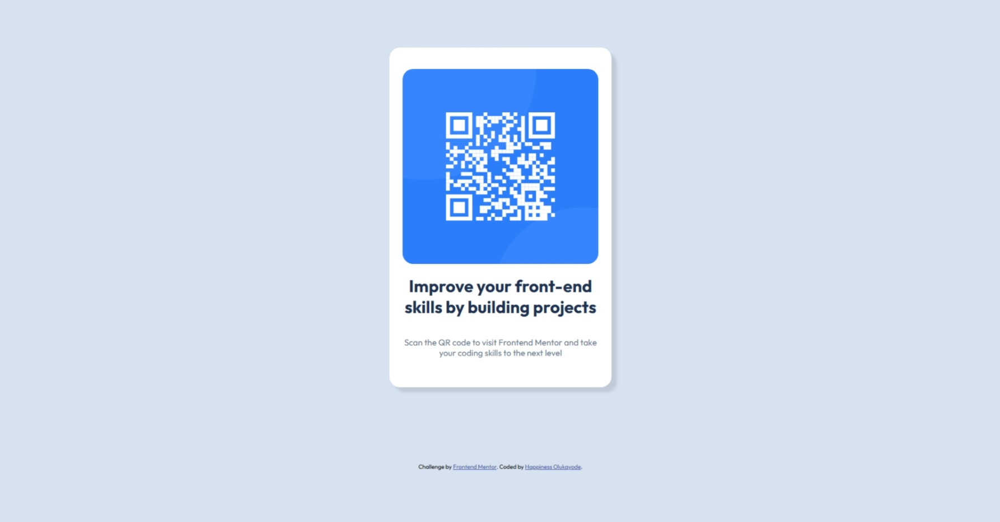

# Frontend Mentor - QR code component solution

This is a solution to the [QR code component challenge on Frontend Mentor](https://www.frontendmentor.io/challenges/qr-code-component-iux_sIO_H). Frontend Mentor challenges help you improve your coding skills by building realistic projects.

## Table of contents

- [Overview](#overview)
  - [Screenshot](#screenshot)
  - [Links](#links)
  - [Built with](#built-with)
  - [What I learned](#what-i-learned)
  - [Continued development](#continued-development)
- [Author](#author)

## Overview

### Screenshot



### Links

- Solution URL: [Add solution URL here](https://github.com/uptowngirl757/qr_code_project/blob/main/qr-code-component-main/index.html)
- Live Site URL: [Add live site URL here](https://your-live-site-url.com)

### Built with

- Semantic HTML5 markup
- CSS custom properties
- Flexbox

### What I learned

I was on a course I found online, a free resource for learning to "write CSS that doesn't break the responsiveness of the web" and I got to apply what I'd been learning with the max-height and min-height CSS code sinppets below. I'm really proud of myself ✨.

I used this CSS:

```css
.qr-code-img {
  width: 100%;
  max-height: 600px;
}
.container {
  min-height: 60vh;
  display: flex;
}
```

Instead of using:

```css
.qr-code-img {
  width: 100%;
  height: 600px;
}
.container {
  height: 60vh;
  display: flex;
}
```

which would have caused a lot of trouble on smaller screens

### Continued development

I really need to work on using mobile first CSS without writing any media queries. CSS that is responsive just by default. I still struggle with that, like A LOT.

## Author

- Frontend Mentor - [@uptowngirl757](https://www.frontendmentor.io/profile/uptowngirl757)
